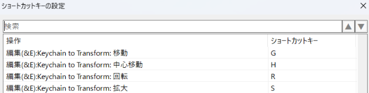

# Keychain to Transform

## 注意事項
>[!IMPORTANT]
>**操作中の値の変化がUndo履歴に大量に積まれます。**
>
>操作前の状態に戻すには、Undoを何度も繰り返す必要があります。
>
>設定の「値を反映する間隔」を長くすると、記録される件数を減らせます(その分プレビューの動きは粗くなります)。

## 概要

Blenderのように、ショートカットキーを続けて押すことでオブジェクトを移動・回転・拡大するAviUtl2の汎用プラグインです。

例えば `G` → `X` → `100` → `Enter` と入力すると、選択中のオブジェクトをX軸方向に100移動します。マウスで動かしながらプレビューで確認することもできます。

## 導入方法

1. 次のどちらかの方法でインストールします。
   - AviUtl2カタログからインストールする。(推奨)(まだカタログに登録してないですが、近日中に登録予定です)
   - [リリース](../../releases)から `KeychainToTransform.au2pkg.zip` をダウンロードし、AviUtl2のプレビューウィンドウにドラッグ&ドロップする。
     - 中心移動で使うスクリプト「中心座標」も一緒にインストールされます。
2. AviUtl2を起動します。
3. **左上メニューの「設定」→「ショートカットキーの設定」で、次の4つのコマンドにキーを割り当てます。** 割り当てるまでは操作できません。

| コマンド | 割り当ての例 |
| --- | --- |
| Keychain to Transform: 移動 | `G` |
| Keychain to Transform: 中心移動 | `H` |
| Keychain to Transform: 回転 | `R` |
| Keychain to Transform: 拡大 | `S` |

### 削除方法

1. AviUtl2を終了します。
2. アプリケーションデータフォルダ内の次のファイル・フォルダを削除します。
   - `Plugin\KeychainToTransform` フォルダ
   - `Script\KeychainToTransform` フォルダ
   - `Plugin\KeychainToTransformSettings.ini`(設定ファイル)
   
(カタログからのアンインストールでも可能です)

## 機能

オブジェクトを選択して、割り当てたキー(以下では `G` / `H` / `R` / `S` とします)を押すと操作が始まります。操作中はマウスの近くに、現在の状態と操作方法が表示されます。

(基本的にBlenderの操作方法に準拠し、一部拡張しています。)

### 基本操作

| 操作 | 内容 |
| --- | --- |
| マウス | 値を変更します(`Shift` / `Ctrl` / `Shift`+`Ctrl` を押している間は、設定した倍率で変化量を調整) |
| ホイール | 移動・中心移動では奥行き(Z)を変更します |
| `Enter` / 左クリック | 確定 |
| `Esc` / 右クリック | キャンセル(操作前の値に戻す) |

### 軸の指定

| 操作 | 内容 |
| --- | --- |
| `X` / `Y` / `Z` | その軸だけを変更します |
| `Shift`+`X` / `Y` / `Z` | その軸以外の2軸を変更します(例: `Shift`+`Z` でX,Y) |
| 同じ軸キーをもう一度(`X` → `X`)、または操作を始めたキーをもう一度(`G` → `G`) | オブジェクト自身の向きを基準にした軸(ローカル軸)に切り替えます |

### 数値入力

数字を入力すると、マウスの代わりにその値で変更します。`Backspace` で1文字削除できます。

| 入力例 | 内容 | 例 |
| --- | --- | --- |
| `10` | 加算 | `G` → `X` → `10` でX座標を+10 |
| `-10.5` | 減算 | `R` → `Z` → `-10.5` でZ軸回転を-10.5 |
| 先頭`=` | 上書き | `G` → `=0` でX,Y,Z座標を0に |
| 先頭`*` , `/` | 掛け算・割り算 | `H` → `Y` → `*2` で中心Y座標を2倍 |
| `5/2` | 式(四則演算) | `S` → `5/2` で拡大率を2.5倍に |
| 末尾`-` | 末尾の `-` で符号を反転(もう一度 `-` で元に戻る) | `G` → `X` → `20/5-` でX座標を-4 |

拡大では入力した値が倍率になります(`2` で2倍、`=150` で拡大率を150に)。軸を指定しない場合はX,Y,Zの3軸すべてに適用します。

### 中間点の値の変更

| 操作 | 内容 |
| --- | --- |
| `←` / `→` | 現在フレームの前後にある始点・中間点・終点を選び、その値だけを変更します(押すたびに前後のキーへ移動) |
| `↓` | 選択を解除します(無選択状態でパラメータを変えると全体移動になります) |

### エフェクトによる変更

| 操作 | 内容 |
| --- | --- |
| `Alt` | 標準描画の代わりに「座標」「中心座標」「回転」「拡大率」エフェクトを追加して変更します |

次の場合は、`Alt` を押さなくても自動でエフェクトを追加して変更します。追加したエフェクトは、キャンセルした場合と値を変えずに確定した場合は削除されます。

- 値に移動方法や式が設定されている(時間変化する)が、前節の操作で中間点を選択せずにパラメータを変えた場合
- 軸を指定して拡大する(標準描画には軸別の拡大率が無いため)
- オブジェクトが対応する項目を持たない(例: グループ制御の中心移動)

### 拡大について

テキストの「サイズ」や図形の「幅」「高さ」など、境界がぼけずに大きさを変えられる項目を持つオブジェクトでは、拡大率の代わりにそちらを変更します(対応表は設定で変更できます)。

回転しているオブジェクトを画面の軸方向に拡大した場合は、オブジェクト自身の各軸に倍率を分けて適用します(例: Z軸回転45度で `S` → `X` → `2` とすると、オブジェクトのX,Yをそれぞれ√2倍。※このとき単にX拡大率を2倍したい場合は、`S` → `X` → `X` → `2` や `S` → `S` → `X` → `2` などとしてローカル軸に切り替えてから拡大すればよいです)。

### カメラ制御について

#### カメラ制御オブジェクトの操作

カメラ制御オブジェクトは、次のように読み替えて操作します。

| 操作 | 変更する項目 |
| --- | --- |
| 移動 | X / Y / Z(カメラの位置) |
| 中心移動 | 目標X / 目標Y / 目標Z(目標点) |
| 回転 | 向き(目標点)と傾き(下記参照) |
| 拡大 | 視野角(`S` → `2` で視野角が1/2になり、大きく写ります) |

カメラ制御には拡大率エフェクトを追加できないため、軸を指定した拡大と、拡大での `Alt` は使えません。

#### カメラの回転

| 操作 | 内容 |
| --- | --- |
| `R` → `X` / `Y` / `Z` | カメラの位置を中心に、画面の軸まわりにカメラ全体を回します |
| `R` → `R` → `X` / `Y` / `Z` (`R` → `X` → `X` なども可) | ローカル軸で回します。`Y` で左右、`X` で上下に向きを変え、`Z` で傾けます  (おそらくこの操作方法のほうが直感的です) |
| `Alt`(任意のタイミング) | カメラの位置ではなく、目標点を中心にカメラを回します。追加でローカル軸指定も可能です。 |

軸を指定しない場合は、マウスの横移動で左右、縦移動で上下に向きを変え、ホイールで傾けます。マウスの縦移動と上下の向きの関係は、設定で反転できます。

#### カメラ制御の対象になっているオブジェクトの操作

軸を指定しないマウス操作は、画面の軸ではなく、カメラから見た向きを基準にします。

- 移動・中心移動: マウスの横・縦・ホイールで、カメラから見た右・下・奥の方向に動かします
- 回転: カメラの視線を軸にして回します(見た目の画面の中で回転します)

軸を指定した操作(`G` → `X` など)は、カメラの向きに関係なく動きます。

### 対応するオブジェクト

- 標準描画を持つオブジェクト(テキスト、図形、画像など)
- 映像再生、グループ制御、基本出力
- カメラ制御(前節「カメラ制御について」を参照)
- 上記以外で、一番上のエフェクトに位置などの項目を持つオブジェクト(点光源、スポット光源など)
- 「座標」「中心座標」「回転」「拡大率」エフェクトを追加できるオブジェクト

## 設定

左上メニューの「設定」→「プラグイン設定」→「Keychain to Transform設定」で変更できます。

| 項目 | 既定値 | 説明 |
| --- | --- | --- |
| 移動の感度 | 1 | マウス1pxあたりの移動量 |
| 回転の感度 | 0.5 | マウス1pxあたりの回転角度 |
| 拡大の感度 | 0.005 | マウス1pxあたりの倍率の変化 |
| ホイール1ノッチあたりの移動量 | 10 | |
| ホイール1ノッチあたりの回転角度 | 5 | カメラ制御の回転で使用 |
| Shift押下中の倍率 | 0.1 | 微調整 |
| Ctrl押下中の倍率 | 10 | 粗調整 |
| Shift+Ctrl押下中の倍率 | 0.01 | より細かい調整 |
| 値を反映する間隔 (ミリ秒) | 33 | 長くするとUndo履歴に記録される件数が減りますが、操作の反映がカクつきます |
| カメラ制御の上下の向きで、マウスの縦方向を反転する | オフ | 既定ではマウスを下に動かすとカメラが上に向きます |
| ホイールの向きを反転する | オフ | 既定ではホイールを上に動かすと奥(Z+)に移動します |
| 拡大率の代わりに優先して変更する項目 | 全体: `サイズ` X: `幅,X幅` Y: `高さ,Y幅` Z: `奥行き,Z幅` | カンマ区切りで、左にあるものを優先します |

## Tips
タイムライン上でCtrlを押しながら複数のオブジェクトを選択し、Ctrlキーを離す前にAltキーを押し、Ctrlキー、Altキーの順番に離すと、複数のオブジェクトを選択しながら操作できます。

## 更新履歴

- v0.1 (2026/9/27): 初版(プレリリース)

## ライセンス

MIT License

同梱スクリプト「中心座標」(`中心座標.anm2`)は、sikemoti氏の「中心座標調整」を命名衝突回避のため改名したもので、MIT License(Copyright (c) 2026 sikemoti)で公開されています。ライセンスの全文は `中心座標_LICENSE.txt` を参照してください。原作者のsikemoti氏に感謝します。
